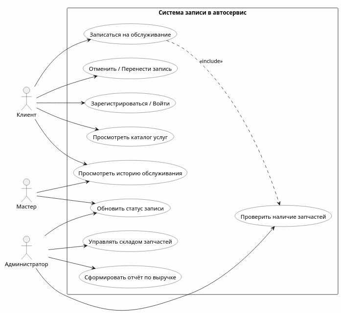

# ОТЧЁТ
## по практической работе
### «Проектирование реляционной базы данных для системы онлайн-записи в автосервис»

**Дисциплина:** УП 01.01
**Вариант:** [3]

**Выполнил(а):** [Борисенко Е.К.]
**Группа:** [454]

**Проверил(а):** [Поликарпочкин М.В,]

**[Юргинский Технологический Колледж]**
**[Юрга] — 2026**

---

## Раздел 1. Анализ предметной области

### 1.1 Описание предметной области
Разрабатываемая база данных предназначена для автоматизации процесса записи клиентов в автосервис на услуги диагностики, шиномонтажа и слесарных работ. Система обеспечивает учёт клиентов, их транспортных средств, каталога услуг, складского учёта запчастей, контроль наличия деталей перед записью и фиксацию выполненных работ с расчётом финансовой выручки.

### 1.2 Основные бизнес-правила
| № | Бизнес-правило | Реализация в БД |
|---|---------------|-----------------|
| 1 | Клиент может владеть несколькими автомобилями | Связь `1:M` между таблицами `clients` и `cars` |
| 2 | Автомобиль характеризуется маркой, моделью и годом выпуска | Атрибуты `make`, `model`, `year` в таблице `cars` с проверкой диапазона года |
| 3 | Услуги разделены на категории: диагностика, шиномонтаж, слесарные работы | Таблица `service_categories` с полем `ENUM` |
| 4 | Каждая услуга может требовать определённый набор запчастей | Промежуточная таблица `service_parts` (связь `M:N`) |
| 5 | Запись запрещена, если необходимых запчастей недостаточно на складе | Триггер `BEFORE INSERT` с проверкой остатков через курсор |
| 6 | Один автомобиль не может быть записан на одно и то же время дважды | Уникальный составной индекс `UNIQUE(car_id, appointment_datetime)` |
| 7 | Фиксируется фактическое использование запчастей по каждой записи | Таблица `appointment_parts` с указанием количества |
| 8 | Выручка рассчитывается только по завершённым записям | Фильтрация `WHERE status = 'завершено'` в аналитических запросах |

---

## Раздел 2. Концептуальная модель

### 2.1 Описание сущностей и атрибутов
| Сущность | Атрибуты | Первичный ключ | Описание |
|----------|----------|---------------|----------|
| `Client` | `client_id`, `last_name`, `first_name`, `patronymic`, `phone`, `email`, `birth_date`, `created_at` | `client_id` | Информация о владельце транспортного средства |
| `Car` | `car_id`, `client_id`, `make`, `model`, `year`, `vin` | `car_id` | Автомобиль клиента |
| `ServiceCategory` | `category_id`, `category_name` | `category_id` | Категория оказываемых услуг |
| `Service` | `service_id`, `service_name`, `category_id`, `price`, `duration_minutes` | `service_id` | Конкретная услуга с ценой и длительностью |
| `Part` | `part_id`, `part_name`, `part_number`, `stock_quantity`, `price` | `part_id` | Запчасть на складе с остатком и закупочной ценой |
| `ServicePart` | `service_id`, `part_id`, `required_quantity` | `(service_id, part_id)` | Нормативный расход запчастей на услугу |
| `Appointment` | `appointment_id`, `client_id`, `car_id`, `service_id`, `appointment_datetime`, `status`, `total_cost`, `created_at` | `appointment_id` | Запись клиента на обслуживание |
| `AppointmentPart` | `appointment_id`, `part_id`, `quantity_used` | `(appointment_id, part_id)` | Фактически списанные запчасти по записи |

### 2.2 Связи и кардинальность
| Связь | Тип | Кардинальность | Описание |
|-------|-----|---------------|----------|
| `Client` → `Car` | `1:M` | Один ко многим | Клиент может иметь несколько авто |
| `Car` → `Appointment` | `1:M` | Один ко многим | История обслуживания конкретного авто |
| `ServiceCategory` → `Service` | `1:M` | Один ко многим | Категория объединяет однотипные услуги |
| `Service` → `Appointment` | `1:M` | Один ко многим | Услуга выбирается в множестве записей |
| `Service` ↔ `Part` | `M:N` | Многие ко многим | Услуга требует запчасти, запчасть подходит к разным услугам |
| `Appointment` ↔ `Part` | `M:N` | Многие ко многим | Запись расходует запчасти, одна запчасть используется в разных записях |

### 2.3 ER-диаграмма


*Рисунок 1. ER-диаграмма базы данных «Система записи в автосервис»*

---

## Раздел 3. Логическая модель и нормализация

### 3.1 Реляционная схема
| Таблица | Столбцы (тип, ограничения) | Связи |
|---------|---------------------------|-------|
| `clients` | `client_id` (INT PK, AUTO_INCREMENT), `last_name`, `first_name`, `patronymic` (VARCHAR), `phone`, `email` (VARCHAR UNIQUE), `birth_date` (DATE), `created_at` (TIMESTAMP) | — |
| `cars` | `car_id` (INT PK), `client_id` (INT FK), `make`, `model` (VARCHAR), `year` (INT), `vin` (VARCHAR UNIQUE) | FK → `clients.client_id` (CASCADE) |
| `service_categories` | `category_id` (INT PK), `category_name` (ENUM) | — |
| `services` | `service_id` (INT PK), `service_name` (VARCHAR UNIQUE), `category_id` (INT FK), `price` (DECIMAL), `duration_minutes` (INT) | FK → `service_categories.category_id` |
| `parts` | `part_id` (INT PK), `part_name`, `part_number` (VARCHAR UNIQUE), `stock_quantity` (INT), `price` (DECIMAL) | — |
| `service_parts` | `service_id`, `part_id` (составной PK), `required_quantity` (INT) | FK → `services`, `parts` |
| `appointments` | `appointment_id` (INT PK), `client_id`, `car_id`, `service_id` (INT FK), `appointment_datetime` (DATETIME), `status` (ENUM), `total_cost` (DECIMAL), `created_at` (TIMESTAMP), UNIQUE(`car_id`, `appointment_datetime`) | FK → `clients`, `cars`, `services` |
| `appointment_parts` | `appointment_id`, `part_id` (составной PK), `quantity_used` (INT) | FK → `appointments`, `parts` |

### 3.2 Приведение к нормальным формам
| Нормальная форма | Обоснование соответствия |
|------------------|--------------------------|
| **1НФ** | Все атрибуты атомарны. Нет составных или многозначных полей. ФИО разделены на три колонки. Телефон и email хранятся как отдельные строки. Категории и статусы вынесены в отдельные таблицы или используют `ENUM`. |
| **2НФ** | В таблицах с составным первичным ключом (`service_parts`, `appointment_parts`) неключевой атрибут (`required_quantity`, `quantity_used`) функционально зависит от **полного** ключа `(service_id, part_id)` / `(appointment_id, part_id)`. В остальных таблицах ключ одиночный, поэтому 2НФ выполняется автоматически. |
| **3НФ** | Отсутствуют транзитивные зависимости. Стоимость услуги (`price`) хранится в `services`, а не дублируется в `appointments`. Название категории вынесено в `service_categories`. Остаток на складе (`stock_quantity`) хранится только в `parts`. Денормализация не применялась, так как объём данных умеренный, а целостность важнее микрооптимизации. |

---

## Раздел 4. SQL-скрипт создания базы данных

```sql
-- ============================================
-- Схема БД: Система записи в автосервис
-- База данных: u913430f_up
-- MySQL 8.0+ | utf8mb4_unicode_ci
-- ============================================

USE u913430f_up;

-- Таблица: Клиенты
CREATE TABLE IF NOT EXISTS clients (
    client_id INT AUTO_INCREMENT PRIMARY KEY,
    last_name VARCHAR(50) NOT NULL,
    first_name VARCHAR(50) NOT NULL,
    patronymic VARCHAR(50),
    phone VARCHAR(20) NOT NULL UNIQUE,
    email VARCHAR(100) NOT NULL UNIQUE,
    birth_date DATE NOT NULL,
    created_at TIMESTAMP DEFAULT CURRENT_TIMESTAMP
) ENGINE=InnoDB DEFAULT CHARSET=utf8mb4 COLLATE=utf8mb4_unicode_ci;

-- Таблица: Автомобили
CREATE TABLE IF NOT EXISTS cars (
    car_id INT AUTO_INCREMENT PRIMARY KEY,
    client_id INT NOT NULL,
    make VARCHAR(50) NOT NULL,
    model VARCHAR(50) NOT NULL,
    `year` INT NOT NULL,
    vin VARCHAR(17) UNIQUE,
    FOREIGN KEY (client_id) REFERENCES clients(client_id) ON DELETE CASCADE ON UPDATE CASCADE,
    INDEX idx_client_cars (client_id)
) ENGINE=InnoDB DEFAULT CHARSET=utf8mb4 COLLATE=utf8mb4_unicode_ci;

-- Таблица: Категории услуг
CREATE TABLE IF NOT EXISTS service_categories (
    category_id INT AUTO_INCREMENT PRIMARY KEY,
    category_name ENUM('диагностика', 'шиномонтаж', 'слесарные работы') NOT NULL UNIQUE
) ENGINE=InnoDB DEFAULT CHARSET=utf8mb4 COLLATE=utf8mb4_unicode_ci;

-- Таблица: Услуги
CREATE TABLE IF NOT EXISTS services (
    service_id INT AUTO_INCREMENT PRIMARY KEY,
    service_name VARCHAR(100) NOT NULL UNIQUE,
    category_id INT NOT NULL,
    price DECIMAL(10,2) NOT NULL,
    duration_minutes INT NOT NULL,
    FOREIGN KEY (category_id) REFERENCES service_categories(category_id) ON DELETE RESTRICT ON UPDATE CASCADE,
    INDEX idx_category (category_id)
) ENGINE=InnoDB DEFAULT CHARSET=utf8mb4 COLLATE=utf8mb4_unicode_ci;

-- Таблица: Запчасти (склад)
CREATE TABLE IF NOT EXISTS parts (
    part_id INT AUTO_INCREMENT PRIMARY KEY,
    part_name VARCHAR(100) NOT NULL,
    part_number VARCHAR(50) NOT NULL UNIQUE,
    stock_quantity INT NOT NULL DEFAULT 0,
    price DECIMAL(10,2) NOT NULL,
    INDEX idx_part_number (part_number)
) ENGINE=InnoDB DEFAULT CHARSET=utf8mb4 COLLATE=utf8mb4_unicode_ci;

-- Таблица: Связь услуга ↔ требуемые запчасти
CREATE TABLE IF NOT EXISTS service_parts (
    service_id INT NOT NULL,
    part_id INT NOT NULL,
    required_quantity INT NOT NULL,
    PRIMARY KEY (service_id, part_id),
    FOREIGN KEY (service_id) REFERENCES services(service_id) ON DELETE CASCADE ON UPDATE CASCADE,
    FOREIGN KEY (part_id) REFERENCES parts(part_id) ON DELETE RESTRICT ON UPDATE CASCADE
) ENGINE=InnoDB DEFAULT CHARSET=utf8mb4 COLLATE=utf8mb4_unicode_ci;

-- Таблица: Записи на обслуживание
CREATE TABLE IF NOT EXISTS appointments (
    appointment_id INT AUTO_INCREMENT PRIMARY KEY,
    client_id INT NOT NULL,
    car_id INT NOT NULL,
    service_id INT NOT NULL,
    appointment_datetime DATETIME NOT NULL,
    status ENUM('запланировано', 'в работе', 'завершено', 'отменено') DEFAULT 'запланировано',
    total_cost DECIMAL(10,2),
    created_at TIMESTAMP DEFAULT CURRENT_TIMESTAMP,
    FOREIGN KEY (client_id) REFERENCES clients(client_id) ON DELETE RESTRICT ON UPDATE CASCADE,
    FOREIGN KEY (car_id) REFERENCES cars(car_id) ON DELETE RESTRICT ON UPDATE CASCADE,
    FOREIGN KEY (service_id) REFERENCES services(service_id) ON DELETE RESTRICT ON UPDATE CASCADE,
    UNIQUE KEY unique_car_slot (car_id, appointment_datetime),
    INDEX idx_appointments_datetime (appointment_datetime),
    INDEX idx_appointments_status (status)
) ENGINE=InnoDB DEFAULT CHARSET=utf8mb4 COLLATE=utf8mb4_unicode_ci;

-- Таблица: Использованные запчасти в записи
CREATE TABLE IF NOT EXISTS appointment_parts (
    appointment_id INT NOT NULL,
    part_id INT NOT NULL,
    quantity_used INT NOT NULL,
    PRIMARY KEY (appointment_id, part_id),
    FOREIGN KEY (appointment_id) REFERENCES appointments(appointment_id) ON DELETE CASCADE ON UPDATE CASCADE,
    FOREIGN KEY (part_id) REFERENCES parts(part_id) ON DELETE RESTRICT ON UPDATE CASCADE
) ENGINE=InnoDB DEFAULT CHARSET=utf8mb4 COLLATE=utf8mb4_unicode_ci;

-- Триггер: проверка наличия запчастей при создании записи
DELIMITER //

DROP TRIGGER IF EXISTS check_parts_availability_before_insert//

CREATE TRIGGER check_parts_availability_before_insert
BEFORE INSERT ON appointments
FOR EACH ROW
BEGIN
    DECLARE insufficient_parts TEXT DEFAULT '';
    DECLARE done INT DEFAULT FALSE;
    DECLARE v_part_id, v_required, v_available INT;
    DECLARE v_part_name VARCHAR(100);

    DECLARE parts_cursor CURSOR FOR
        SELECT sp.part_id, sp.required_quantity, p.part_name, p.stock_quantity
        FROM service_parts sp
        JOIN parts p ON sp.part_id = p.part_id
        WHERE sp.service_id = NEW.service_id;

    DECLARE CONTINUE HANDLER FOR NOT FOUND SET done = TRUE;

    OPEN parts_cursor;
    read_loop: LOOP
        FETCH parts_cursor INTO v_part_id, v_required, v_part_name, v_available;
        IF done THEN LEAVE read_loop; END IF;
        IF v_available < v_required THEN
            SET insufficient_parts = IF(insufficient_parts = '', v_part_name, CONCAT(insufficient_parts, ', ', v_part_name));
        END IF;
    END LOOP;
    CLOSE parts_cursor;

    IF insufficient_parts != '' THEN
        SIGNAL SQLSTATE '45000' SET MESSAGE_TEXT = CONCAT('Недостаточно запчастей: ', insufficient_parts);
    END IF;
END//

DELIMITER ;

## Раздел 5. Тестовые данные и примеры запросов

### 5.1 Заполнение тестовыми данными

-- Категории
INSERT INTO service_categories (category_name) VALUES
('диагностика'), ('шиномонтаж'), ('слесарные работы');

-- Услуги
INSERT INTO services (service_name, category_id, price, duration_minutes) VALUES
('Компьютерная диагностика', 1, 2500.00, 45),
('Диагностика ходовой', 1, 1500.00, 30),
('Балансировка колёс', 2, 800.00, 20),
('Замена шин', 2, 2000.00, 40),
('Замена масла', 3, 1200.00, 30),
('Замена тормозных колодок', 3, 3500.00, 60);

-- Запчасти
INSERT INTO parts (part_name, part_number, stock_quantity, price) VALUES
('Моторное масло 5W-40', 'OIL-5W40-4L', 25, 2800.00),
('Масляный фильтр', 'FILTER-OIL-001', 50, 450.00),
('Тормозные колодки передние', 'BRAKE-FRT-001', 12, 2200.00),
('Шина летняя 205/55 R16', 'TIRE-SUM-205', 30, 4500.00),
('Грузик балансировочный 10г', 'WEIGHT-10G', 200, 15.00);

-- Нормативы расхода
INSERT INTO service_parts (service_id, part_id, required_quantity) VALUES
(5, 1, 1), (5, 2, 1),
(6, 3, 1),
(4, 4, 4),
(3, 5, 20);

-- Клиенты
INSERT INTO clients (last_name, first_name, patronymic, phone, email, birth_date) VALUES
('Иванов', 'Александр', 'Петрович', '+79161234567', 'ivanov@example.com', '1985-03-15'),
('Смирнова', 'Елена', 'Дмитриевна', '+79262345678', 'smirnova@example.com', '1990-07-22'),
('Козлов', 'Михаил', 'Андреевич', '+79033456789', 'kozlov@example.com', '1978-11-05'),
('Петрова', 'Анна', 'Сергеевна', '+79154567890', 'petrova@example.com', '1993-01-18'),
('Волков', 'Дмитрий', 'Игоревич', '+79275678901', 'volkov@example.com', '1988-09-30');

-- Автомобили
INSERT INTO cars (client_id, make, model, year, vin) VALUES
(1, 'Toyota', 'Camry', 2020, 'JTDBR32E050123456'),
(1, 'VAZ', 'Granta', 2018, 'XTA219000J0123456'),
(2, 'Hyundai', 'Solaris', 2021, 'Z94CT41DBMR012345'),
(3, 'Ford', 'Focus', 2019, '1FADP3K29JL123456'),
(4, 'Kia', 'Rio', 2022, 'Z94CT41DBMR987654');

-- Записи
INSERT INTO appointments (client_id, car_id, service_id, appointment_datetime, status) VALUES
(1, 1, 5, '2026-05-25 10:00:00', 'завершено'),
(2, 3, 3, '2026-05-25 11:30:00', 'завершено'),
(1, 2, 1, '2026-05-26 09:00:00', 'запланировано'),
(3, 4, 6, '2026-05-27 14:00:00', 'завершено'),
(4, 5, 4, '2026-05-25 15:00:00', 'завершено');

-- Списанные запчасти
INSERT INTO appointment_parts (appointment_id, part_id, quantity_used) VALUES
(1, 1, 1), (1, 2, 1),
(2, 5, 20),
(4, 3, 1),
(5, 4, 4);

### 5.2 Аналитические запросы

Запрос 1. Детализация записей (JOIN 4 таблиц)
Бизнес-задача: Вывод полного списка записей для админ-панели с данными о клиенте, автомобиле, категории и стоимости услуги.

SELECT
    CONCAT(c.last_name, ' ', c.first_name) AS client_name,
    CONCAT(car.make, ' ', car.model, ' (', car.year, ')') AS vehicle,
    sc.category_name AS service_category,
    s.service_name,
    a.appointment_datetime,
    a.status,
    s.price AS service_price
FROM appointments a
JOIN clients c ON a.client_id = c.client_id
JOIN cars car ON a.car_id = car.car_id
JOIN services s ON a.service_id = s.service_id
JOIN service_categories sc ON s.category_id = sc.category_id
ORDER BY a.appointment_datetime;

Запрос 2. Группировка с агрегацией и HAVING
Бизнес-задача: Выявление наиболее доходных категорий услуг по завершённым визитам.

SELECT
    sc.category_name,
    COUNT(a.appointment_id) AS completed_count,
    SUM(s.price) AS total_revenue
FROM appointments a
JOIN services s ON a.service_id = s.service_id
JOIN service_categories sc ON s.category_id = sc.category_id
WHERE a.status = 'завершено'
GROUP BY sc.category_id, sc.category_name
HAVING total_revenue > 1000
ORDER BY total_revenue DESC;

Результат:

+------------------+-----------------+---------------+
| category_name    | completed_count | total_revenue |
+------------------+-----------------+---------------+
| слесарные работы |               2 |       4700.00 |
| шиномонтаж       |               2 |       2800.00 |
+------------------+-----------------+---------------+

Запрос 3. Подсчёт выручки за день (требование задания)
Бизнес-задача: Расчёт ежедневной выручки автосервиса с учётом стоимости услуг и реализованных запчастей.

SELECT
    DATE(a.appointment_datetime) AS report_date,
    COUNT(DISTINCT a.appointment_id) AS total_appointments,
    SUM(s.price) AS services_revenue,
    COALESCE(SUM(p.price * ap.quantity_used), 0) AS parts_revenue,
    SUM(s.price) + COALESCE(SUM(p.price * ap.quantity_used), 0) AS total_daily_revenue
FROM appointments a
JOIN services s ON a.service_id = s.service_id
LEFT JOIN appointment_parts ap ON a.appointment_id = ap.appointment_id
LEFT JOIN parts p ON ap.part_id = p.part_id
WHERE a.status = 'завершено'
  AND DATE(a.appointment_datetime) = '2026-05-25'
GROUP BY DATE(a.appointment_datetime);

Результат:

+-------------+-------------------+------------------+---------------+----------------------+
| report_date | total_appointments| services_revenue | parts_revenue | total_daily_revenue  |
+-------------+-------------------+------------------+---------------+----------------------+
| 2026-05-25  |                 3 |          4000.00 |      21600.00 |             25600.00 |
+-------------+-------------------+------------------+---------------+----------------------+

## Раздел 6. Проверка ограничений целостности

###  Уникальность временного слота

INSERT INTO appointments (client_id, car_id, service_id, appointment_datetime)
VALUES (1, 1, 1, '2026-05-25 10:00:00');

Результат: #1062 - Duplicate entry '1-2026-05-25 10:00:00' for key 'unique_car_slot'
✅ Ограничение блокирует двойную запись одного автомобиля на одно время.

### 6.2 Внешний ключ (RESTRICT)

DELETE FROM services WHERE service_id = 5;

Результат: #1451 - Cannot delete or update a parent row: a foreign key constraint fails
✅ Защита от удаления услуги, на которую существуют активные записи.

### 6.3 Триггер проверки наличия запчастей

-- Искусственное создание дефицита
UPDATE parts SET stock_quantity = 0 WHERE part_number = 'BRAKE-FRT-001';

-- Попытка записи на услугу, требующую данную запчасть
INSERT INTO appointments (client_id, car_id, service_id, appointment_datetime)
VALUES (1, 1, 6, '2026-06-01 10:00:00');

Результат: #1644 - Недостаточно запчастей: Тормозные колодки передние
✅ Триггер корректно прерывает транзакцию при нехватке деталей.

### 6.4 Уникальность контактных данных клиента

INSERT INTO clients (last_name, first_name, phone, email, birth_date)
VALUES ('Тестов', 'Иван', '+79161234567', 'new@example.com', '1990-01-01');

Результат: #1062 - Duplicate entry '+79161234567' for key 'phone'
✅ Запрет дублирования номеров телефонов.

## Раздел 7. Выводы
### 7.1 Анализ возникших сложностей

    Реализация бизнес-логики на уровне СУБД: Создание триггера с курсором потребовало глубокого понимания синтаксиса MySQL, работы с переменными и генерации пользовательских ошибок через SIGNAL.
    Совместимость с графическими клиентами: Статический анализатор phpMyAdmin не поддерживает CHECK-ограничения с функциями (CURDATE()), поэтому проверка возраста клиента вынесена на уровень приложения, а в схеме оставлена только валидация форматов.
    Проектирование связей M:N: Требовалось чётко разделить нормативный расход (service_parts) и фактическое списание (appointment_parts) для сохранения исторической точности отчётности.

### 7.2 Оценка соответствия требованиям

| Требование задания | Реализация | Статус |
|-------------------|------------|--------|
| Учёт машины (марка, модель, год) | Таблица `cars` с полями `make`, `model`, `year` | ✅ |
| Категоризация услуг | `service_categories` + `ENUM` | ✅ |
| Привязка запчастей к услугам | Таблица `service_parts` | ✅ |
| Запрет записи при отсутствии запчастей | Триггер `check_parts_availability_before_insert` | ✅ |
| Подсчёт выручки за день | Запрос с `SUM()`, `COALESCE()`, группировкой по дате | ✅ |
| Целостность данных | FOREIGN KEY, UNIQUE, индексы, транзакционная логика | ✅ |

### 7.3 Предложения по развитию схемы

    Хранимая процедура create_appointment() для инкапсуляции валидации, проверки расписания и создания записи в одной транзакции.
    Триггер AFTER UPDATE на appointments для автоматического списания запчастей при переходе статуса в 'завершено'.
    Представление v_daily_revenue для упрощения формирования бухгалтерской отчётности.
    Партиционирование таблицы appointments по месяцам при росте объёма данных свыше 1 млн записей.

### 7.4 Приобретённые навыки
✅ Проектирование реляционной схемы с соблюдением 1НФ, 2НФ, 3НФ
✅ Реализация связей 1:M и M:N в MySQL через внешние ключи и составные PK
✅ Создание и отладка триггеров с курсорами и пользовательскими исключениями
✅ Написание аналитических запросов с JOIN, GROUP BY, COALESCE, оконными функциями
✅ Тестирование ограничений целостности (UNIQUE, FOREIGN KEY, CHECK, триггеры)
✅ Оформление технической документации в Markdown и публикация на GitHub
